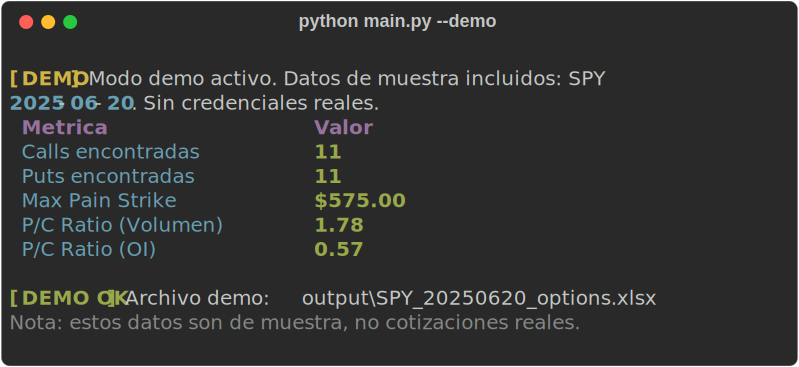
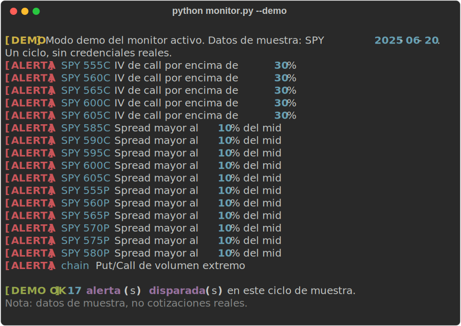

# Options Chain Fetcher

[](https://github.com/simonchiabo/options-chain-fetcher/actions)
[](https://www.python.org/)
[](LICENSE)

Herramienta de analisis de **opciones** sobre la **Schwab API** en dos partes:

1. **Exportador** — descarga la option chain y la vuelca a un Excel formateado con Greeks, breakeven, Max Pain y Put/Call Ratio.
2. **Monitor de alertas** — vigila la cadena en vivo y dispara alertas (Telegram + toast de Windows) cuando se cruzan umbrales que vos defines en un archivo YAML.



## Probalo sin credenciales

Trae datos de muestra incluidos: corre el pipeline completo **sin Schwab API ni OAuth**.

```bash
pip install -r requirements.txt

python main.py --demo       # genera el Excel con la cadena de ejemplo
python monitor.py --demo    # evalua las reglas y muestra las alertas que disparan
```

## Features

**Analisis y export**
- Greeks completos (Delta, Gamma, Theta, Vega) por contrato
- **Max Pain** calculado desde el Open Interest
- **Put/Call Ratio** por volumen y por OI
- **Breakeven** por contrato (strike +/- midpoint) y spread bid/ask
- IV Skew multi-vencimiento en una hoja aparte
- Excel con sheets CALLS / PUTS / ANALYSIS / INFO y filas ITM destacadas
- Salida en terminal con tablas `rich`

**Monitor de alertas en vivo**
- Polling continuo con intervalo configurable
- Reglas declarativas en **YAML** (sin tocar codigo): por contrato (IV, spread, delta, moneyness...) o por cadena (P/C ratio, distancia a Max Pain)
- Capa de **normalizacion** que limpia datos de la API (centinelas, contratos sin cotizacion, escala de IV) para evitar falsos positivos
- **Cooldown edge-triggered**: avisa al cruzar el umbral, no spamea cada ciclo
- Notificaciones por **Telegram** y **toast de Windows** (canales pluggables, el token nunca se loguea)

## Instalacion

```bash
git clone https://github.com/simonchiabo/options-chain-fetcher.git
cd options-chain-fetcher
python -m venv .venv
source .venv/Scripts/activate  # Windows Git Bash
pip install -r requirements.txt
cp .env.example .env            # completar con tus credenciales Schwab (no hace falta para --demo)
```

Ver `docs/schwab_setup.md` para crear la app en el portal de Schwab.

## Uso — exportador

```bash
# Cadena completa para SPY vencimiento 2025-06-20
python main.py --symbol SPY --expiration 2025-06-20

# Solo calls, 10 strikes alrededor del ATM
python main.py -s QQQ -e 2025-07-18 -k 10 -t CALL

# Multiples vencimientos con IV Skew
python main.py -s SPY -E "2025-06-20,2025-07-18,2025-08-15"
```

El Excel contiene:

| Sheet | Contenido |
|---|---|
| **CALLS** | Cadena de calls con Greeks, breakeven, spread, ITM destacado |
| **PUTS** | Cadena de puts con la misma estructura |
| **ANALYSIS** | Max Pain, P/C Ratio (Vol y OI), totales |
| **INFO** | Metadatos: simbolo, fecha, hora de descarga, fuente |

## Uso — monitor de alertas

```bash
# Copiar el ejemplo de reglas y ajustar umbrales
cp rules.example.yaml rules.yaml

python monitor.py --symbol SPY --expiration 2025-06-20 --rules rules.yaml --interval 60
```



### Reglas (YAML)

`scope: contract` evalua cada contrato; `scope: chain` evalua un agregado de la cadena.
La IV se expresa en **fraccion decimal** (`0.30` = 30%).

```yaml
rules:
  - name: high_iv_calls
    scope: contract
    type: CALL
    field: iv
    operator: gt          # gt, lt, gte, lte, eq, between, outside
    value: 0.30
    message: "IV de call por encima de 30%"

  - name: put_call_extreme
    scope: chain
    field: pc_volume_ratio
    operator: gt
    value: 1.5
```

Campos disponibles — contrato: `strike, bid, ask, mid, spread, spread_pct, last, volume, openInterest, delta, gamma, theta, vega, iv, moneyness, inTheMoney`; cadena: `pc_volume_ratio, pc_oi_ratio, max_pain_strike, underlying_price, distance_to_max_pain, distance_to_max_pain_pct`.

### Notificaciones

En `.env`:

```
ALERTS_DESKTOP=true          # toast de Windows
ALERTS_TELEGRAM=false        # poner true y completar abajo para Telegram
TELEGRAM_BOT_TOKEN=          # token de @BotFather
TELEGRAM_CHAT_ID=            # chat destino
ALERT_MIN_INTERVAL=300       # segundos minimos entre re-avisos de la misma alerta
```

`--market-hours-only` salta los ciclos fuera del horario regular del mercado US.

## Configuracion (.env)

```
SCHWAB_CLIENT_ID=tu_app_key
SCHWAB_CLIENT_SECRET=tu_app_secret
SCHWAB_REDIRECT_URI=https://127.0.0.1:8182
OUTPUT_DIR=output
```

## Tests

```bash
python -m pytest --cov=src --cov=main --cov=config --cov=monitor -q
```

**157 tests, ~88% coverage.** Sin red ni credenciales: todos los tests usan datos locales.

## Estructura

```
options-chain-fetcher/
  main.py            # CLI exportador (+ modo --demo)
  monitor.py         # monitor continuo de alertas (+ modo --demo)
  config.py          # variables de entorno y constantes
  rules.example.yaml # reglas de alerta de ejemplo
  examples/
    sample_chain.json  # cadena de muestra para los demos
  src/
    auth.py          # OAuth2 con schwab-py
    fetcher.py       # GET /marketdata/v1/chains
    parser.py        # JSON -> DataFrames + breakeven
    normalizer.py    # limpieza y metricas por contrato
    analyzer.py      # Max Pain, P/C Ratio, IV Skew, chain metrics
    rules.py         # motor de reglas declarativo (YAML)
    alert_state.py   # cooldown edge-triggered
    notifier.py      # notificadores Telegram / desktop
    exporter.py      # DataFrames -> Excel formateado
  tests/             # 157 tests con pytest
```

## Licencia

[MIT](LICENSE) (c) 2026 Simon Chiabo
